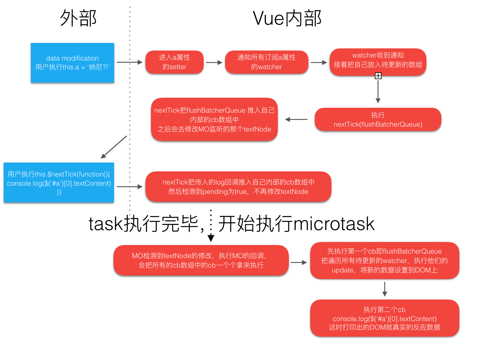

# 深度解析vue的$nextTick的实现原理 

## 前提

vue 中有一个我们经常会用到的api，**nextTick**。我们都知道他是个可以在Dom更新后才执行的回调，比如下面的代码：

```javascript
this.msg = 'hello'  // 假设msg是data上的值

// Dom还没更新

this.$nextTick(() => {
    // Dom更新了
})
```

每次用它的时候，我都会想，nextTick是怎么实现的呢，难道是监听了Dom的变化吗？于是我去看了下nextTick的实现源码，根据源码，我们可以详细了解下这个货。

（注：在阅读之前需要了解 **事件循环机制** 、**microtask** 和 **task/macrotask** 的基本概念，可参考我写的文章 [JavaScript并发模型与Event Loop](https://github.com/FlyDreame/blog/issues/1)）

## 正文

前提中我们猜想是不是监听了Dom的更新，在HTML5中的确是有个api：**MutationObserver**，他可以监听Dom对象的变动（节点的删除、属性修改等） 。代码示例如下：

```javascript
let mo = new MutationObserver(callback) //callback 是Dom更新后的回调函数
let domTarget = 你想要监听的dom节点
mo.observe(domTarget, {
      characterData: true //说明监听文本内容的修改。
})
```

那么vue是不是用**MutationObserver**来监听Dom是否更新完毕的呢？然后我们打开vue的部分源码看看：

```javascript
// 创建一个MutationObserver,observer监听到dom改动之后后执行回调nextTickHandler
    var observer = new MutationObserver(nextTickHandler)
    var textNode = document.createTextNode(counter)
    // 调用MutationObserver的接口,观测文本节点的字符内容
    observer.observe(textNode, {
      characterData: true
    })
```

很明显我们在代码中看到了**MutationObserver**，但是**MutationObserver**监听Dom不对啊，源码中监听的是自己创建的文本节点，难道这个文本节点变化就能代表其他Dom的变化吗，很明显这个结论不成立。

其实nextTick的实现原理并不是基于**MutationObserver**，而是稍微借用的了**MutationObserver**的**microtask**特性，下面让我们看下nextTick的全部代码（代码版本为2.4.x）：

```javascript
export const nextTick = (function () {
  var callbacks = []
  var pending = false
  var timerFunc
  
  function nextTickHandler () {
    pending = false
    // 之所以要slice复制一份出来是因为有的cb执行过程中又会往callbacks中加入内容
    // 比如$nextTick的回调函数里又有$nextTick
    // 这些是应该放入到下一个轮次的nextTick去执行的,
    // 所以拷贝一份当前的,遍历执行完当前的即可,避免无休止的执行下去
    var copies = callbacks.slice(0)
    callbacks = []
    for (var i = 0; i < copies.length; i++) {
      copies[i]()  // 遍历执行回调
    }
  }
    
  /*--------------------------确定timerFunc---------------------------*/
  /* 这一坨代码就是为了确定timerFunc*/
  // ios9.3以上的WebView的MutationObserver有bug，
  //所以在hasMutationObserverBug中存放了是否是这种情况
  if (typeof MutationObserver !== 'undefined' && !hasMutationObserverBug) {
    var counter = 1
    // 创建一个MutationObserver,observer监听到dom改动之后后执行回调nextTickHandler
    var observer = new MutationObserver(nextTickHandler)
    var textNode = document.createTextNode(counter)
    // 调用MutationObserver的接口,观测文本节点的字符内容
    observer.observe(textNode, {
      characterData: true
    })
    // 每次执行timerFunc都会让文本节点的内容在0/1之间切换,
    // 不用true/false可能是有的浏览器对于文本节点设置内容为true/false有bug？
    // 切换之后将新值赋值到那个我们MutationObserver观测的文本节点上去
    timerFunc = function () {
      counter = (counter + 1) % 2
      textNode.data = counter
    }
  } else {
    // webpack attempts to inject a shim for setImmediate
    // if it is used as a global, so we have to work around that to
    // avoid bundling unnecessary code.
	// webpack默认会在代码中插入setImmediate的垫片
    // 没有MutationObserver就优先用setImmediate，不行再用setTimeout
    const context = inBrowser
      ? window
      : typeof global !== 'undefined' ? global : {}
    timerFunc = context.setImmediate || setTimeout
  }
  /*--------------------------确定timerFunc---------------------------*/
    
  return function (cb, ctx) {
    var func = ctx
      ? function () { cb.call(ctx) }
      : cb
    callbacks.push(func)
    // 如果pending为true, 就其实表明本轮事件循环中已经执行过timerFunc(nextTickHandler, 0)
    if (pending) return
    pending = true
    timerFunc(nextTickHandler, 0)
  }
})()
```

我们可以看下中间的一坨代码，是为了确定timerFunc函数，而timerFunc函数的作用就是利用其**microtask**特性异步执行。但是为什么不直接用**MutationObserver**呢？对于这个问题，我们可以先看看下面的示例

```javascript
for (let i=0; i<1000; i++) {
    this.num = i		// 假设num是data上的数据
}
this.$nextTick(() => {
    console.log('更新Dom')
})
```

在上面这一段代码运行后，控制台只输出了一个`'更新Dom'`，并没有输出1000个来，不是说好的数据改变，Dom就更新呢？其实吧，现在这种结果才是对的，假如同一个数据我改了1000次，Dom也更新1000次，那么对浏览器的压力是非常大的。最好就是现在这个样子的，不管数据怎么改变，在数据全部更新后再去更新Dom，这样只更新一次Dom就好了。

那么问题又来了，怎么保证在全部数据更新后就更新Dom呢，怎么保证更新Dom后就能执行$nextTick的回调函数呢。

首先我们要知道，在数据更新后，vue模块中的watcher观测到数据变化后会执行`nextTick(flushBatcherQueue) `，`flushBatcherQueue`则负责执行完成所有的dom更新操作（这一块的详细流程我会在下一篇文章详细说）。 也就是说在数据更新后就执行了`nextTick`，我们根据nextTick的源码来看，`flushBatcherQueue`被push到了`callbacks`数组，又因为此时pending为false，便执行了`timerFunc`，`nextTickHandler`被添加了**microtask**队列。此时的状态是这样的：

```javascript
// callbacks数组
[
    flushBatcherQueue
]

// microtask队列
[
    nextTickHandler
]
```

因为`nextTickHandler`被添加进了**microtask**队列，所以要等待全部代码执行完毕才能再执行`nextTickHandler`，所以接下来会先执行`this.$nextTick(cb)`，同样是调用`nextTick`，也就是`nextTick(cb)`，`cb`被push进`callbacks`，但此时`pending`为true，并不会执行`nextTickHandler`（因为每执行一次`nextTickHandler`，都会往**microtask**队列里加一个任务，此时并没有必要）。所以此时的状态如下：

```javascript
// callbacks数组
[
    flushBatcherQueue,
    cb
]

// microtask队列
[
    nextTickHandler
]
```

在nextTick执行完后，若执行栈里为空，就会执行**microtask**队列的任务，在我们的例子中来看，**microtask**队列的任务只有一个`nextTickHandler`，于是就执行`nextTickHandler`。而`nextTickHandler`的主要代码是遍历执行`callbacks`数组里的函数，也就是先执行`flushBatcherQueue`将数据更新到Dom上，然后再执行nextTick的回调函数`cb`，这样整个流程就下来了。下面我盗一张图来展示下主要流程：



也就是说，更新Dom函数和nextTick的回调函数都在**microtask**队列里，而**microtask**队列只会在所有同步任务都执行完后才会执行，这样就保证了，Dom更新和nextTick的回调函数一定在数据更新后，而`callbacks`数组里的顺序保证了nextTick的回调函数一定在Dom更新后（特别提醒：Dom更新是同步的，ui渲染才是异步的）。

## 结论

用**MutationObserver**只是因为他的**microtask**特性，在源码中我们也看到了假如不支持**MutationObserver**，还有**setImmediate**等选择，最后实在不行只能用setTimeOut（setTimeOut只有**Macrotasks**特性，没办法才用他 ）。其实假如有更好的选择，**MutationObserver**也会被换掉，实际上在Vue2.5.x以后，**MutationObserver**也确实因为某些兼容问题被去掉了。

## 参考文献

1. [Vue源码详解之nextTick：MutationObserver只是浮云，microtask才是核心！](https://github.com/Ma63d/vue-analysis/issues/6)
2. [全面解析Vue.nextTick实现原理](https://juejin.im/entry/5aced80b518825482e39441e)
3. [Vue.js异步更新DOM策略及nextTick](https://github.com/answershuto/learnVue/blob/master/docs/Vue.js%E5%BC%82%E6%AD%A5%E6%9B%B4%E6%96%B0DOM%E7%AD%96%E7%95%A5%E5%8F%8AnextTick.MarkDown)
4. [渲染函数的观察者与进阶的数据响应系统](http://hcysun.me/vue-design/art/8vue-reactive-dep-watch.html#nexttick-%E7%9A%84%E5%AE%9E%E7%8E%B0)

